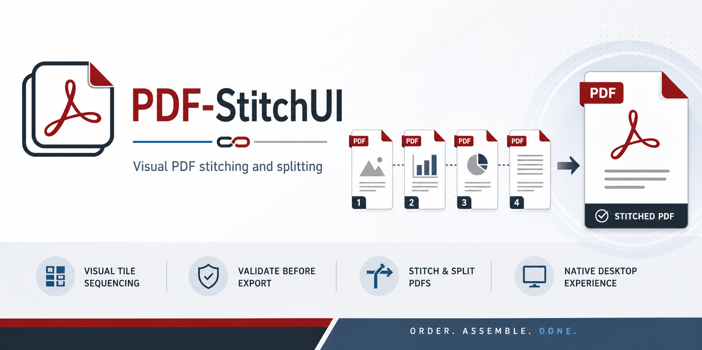

# PDF-StitchUI

`PDF-StitchUI` is a desktop Java application for stitching multiple PDFs into one ordered output and for splitting one PDF into multiple outputs with allocation validation.

It is built for native desktop use rather than the browser. On Windows, the app uses native file dialogs where standard Java supports them, so common shell locations such as OneDrive are available during file open and save flows.



## What It Does

`PDF-StitchUI` has two primary modes:

- `Stitch`: combine many PDFs into one output PDF with visual tile-based sequencing
- `Split`: break one PDF into many output PDFs

Both workflows are designed around validation before export so users can catch issues before writing files.

## Branding

The selected product identity direction is:

- concept: `Tile Sequence`
- variant: `Balanced`

This brand direction emphasizes the core stitch workflow: ordered document tiles resolving into one final assembled PDF.

Branding reference materials live under [branding/](C:/Users/ameli/OneDrive/Documents/New%20project%202/branding), including:

- [branding/decision.md](C:/Users/ameli/OneDrive/Documents/New%20project%202/branding/decision.md)
- [branding/brand-brief.md](C:/Users/ameli/OneDrive/Documents/New%20project%202/branding/brand-brief.md)
- [branding/refinement-prompt.md](C:/Users/ameli/OneDrive/Documents/New%20project%202/branding/refinement-prompt.md)

## Features

### Stitch Mode

- Add multiple PDFs and build one final stitched document.
- Add one or more PDF files with a native file picker.
- Add a folder and recursively collect all PDFs inside it.
- Drag PDF files or folders from Explorer directly onto the window.
- View each source PDF as a large tile with:
  - first-page thumbnail
  - filename
  - sequence number
  - page count
  - file size
  - page-range summary
  - rotation summary
  - warning or blocking status
- Reorder tiles by drag-and-drop.
- Reorder tiles with move-left / move-right controls for users who do not want to drag.
- Duplicate a tile without re-adding the source file.
- Apply page ranges per tile, such as `1-3, 6, 8-10`.
- Rotate tiles left or right before export.
- Remove selected tiles or clear the full collection.
- Restore the previous stitch session when the app reopens.
- Export one stitched PDF with:
  - bookmarks
  - optional form flattening
  - optional compression
- Offer to open the exported PDF after save.

### Split Mode

- Load one source PDF.
- Create multiple output groups such as `File 1`, `File 2`, and so on.
- Assign pages to each group using page specifications such as:
  - `1-3`
  - `4, 6, 7`
  - `9-11`
- Validate that:
  - every page is assigned
  - no page is assigned more than once
  - page specs are valid
  - output filenames are valid
  - duplicate output filenames are rejected
- Highlight group-level issues directly in the split table.
- Export one PDF per group into a selected output folder.

## Example Split Workflow

Given a 12-page PDF, a user can define:

- `File 1` -> `1-3`
- `File 2` -> `4,6,7`
- `File 3` -> `8,12`
- `File 4` -> `9-11`

The app will report:

- `Unassigned pages: 5`

and block export until page `5` is assigned exactly once.

## Validation Behavior

### Stitch Validation

Stitch export is blocked when:

- a source tile is still loading
- a source PDF cannot be read
- a tile page range is invalid
- a tile resolves to zero export pages

### Split Validation

Split export is blocked when:

- no source PDF is loaded
- no output groups exist
- a group has a blank or invalid output name
- a group has an invalid page specification
- a group resolves to zero pages
- any source page is unassigned
- any source page is assigned to multiple groups

Split page specs accept only:

- digits
- commas
- spaces
- hyphens

Split output filenames reject:

- invalid Windows filename characters: `\ / : * ? " < > |`
- trailing spaces
- trailing periods
- reserved Windows device names such as `CON`, `PRN`, `AUX`, `NUL`, `COM1`, `LPT1`

## Requirements

- Java 21
- Windows, macOS, or Linux

For building from source:

- Maven is not required separately because the repository includes Maven Wrapper

For native packaging:

- `jpackage`
- platform-specific packaging dependencies

## Releases

The current public release is [v1.0.0](https://github.com/AmesInc/PDF-StitchUI/releases/tag/v1.0.0).

Release assets include:

- `pdf-stitchui-1.0.0.jar`: runnable shaded jar
- `pdf-stitchui-jar.zip`: zipped jar distribution
- `native-windows-latest.zip`: Windows native package bundle
- `native-macos-latest.zip`: macOS native package bundle
- `native-ubuntu-latest.zip`: Linux native package bundle

If you only want to run the app and already have Java 21 installed, download the jar and run it directly.

If you want an OS-specific packaged app, download the native zip for your platform and unpack it locally.

## Quick Start

### Windows PowerShell

```powershell
.\mvnw.cmd package
java -jar .\target\pdf-stitchui-1.0.0.jar
```

### macOS or Linux

```bash
./mvnw package
java -jar ./target/pdf-stitchui-1.0.0.jar
```

## Development Workflow

### Build

```powershell
.\mvnw.cmd package
```

### Run

```powershell
java -jar .\target\pdf-stitchui-1.0.0.jar
```

### Smoke Test Areas

When changing the app, the most important manual checks are:

1. Launch behavior
2. Stitch add / reorder / export
3. Split load / allocate / validation / export
4. Native dialog behavior on the current OS

## Keyboard Shortcuts

These apply to the stitch tile workspace:

- `Ctrl+O`: add PDF files
- `Ctrl+Shift+O`: add a folder
- `Ctrl+D`: duplicate the selected tiles
- `Alt+Left`: move selected tiles left
- `Alt+Right`: move selected tiles right
- `Delete`: remove the selected tiles
- `Ctrl+Shift+S`: export the stitched PDF

## Packaging

Platform packaging scripts live under [`packaging/`](C:/Users/ameli/OneDrive/Documents/New%20project%202/packaging).

Additional notes are in [packaging/README.md](C:/Users/ameli/OneDrive/Documents/New%20project%202/packaging/README.md).

Current packaging should be treated as structurally ready for branded icons and installer assets. Final branded production assets should follow the selected `Tile Sequence / Balanced` direction in [branding/decision.md](C:/Users/ameli/OneDrive/Documents/New%20project%202/branding/decision.md).

### Windows

Build the Windows package with:

```powershell
powershell -ExecutionPolicy Bypass -File .\packaging\windows\package.ps1
```

This script is set up to produce a `jpackage` app-image and can produce an MSI when WiX is installed.

### macOS

Build from macOS with:

```bash
./packaging/macos/package.sh
```

### Linux

Build from Linux with:

```bash
./packaging/linux/package.sh
```

## Project Structure

- [src/main/java/com/ameli/pdfstitcher/PdfStitcherApp.java](C:/Users/ameli/OneDrive/Documents/New%20project%202/src/main/java/com/ameli/pdfstitcher/PdfStitcherApp.java): application entry point and single-instance coordination
- [src/main/java/com/ameli/pdfstitcher/PdfStitcherFrame.java](C:/Users/ameli/OneDrive/Documents/New%20project%202/src/main/java/com/ameli/pdfstitcher/PdfStitcherFrame.java): main frame and stitch-mode UI
- [src/main/java/com/ameli/pdfstitcher/PdfTileRenderer.java](C:/Users/ameli/OneDrive/Documents/New%20project%202/src/main/java/com/ameli/pdfstitcher/PdfTileRenderer.java): stitch tile rendering
- [src/main/java/com/ameli/pdfstitcher/PdfTileList.java](C:/Users/ameli/OneDrive/Documents/New%20project%202/src/main/java/com/ameli/pdfstitcher/PdfTileList.java): drag/drop list behavior for stitch tiles
- [src/main/java/com/ameli/pdfstitcher/PageRangeParser.java](C:/Users/ameli/OneDrive/Documents/New%20project%202/src/main/java/com/ameli/pdfstitcher/PageRangeParser.java): shared page-range parser
- [src/main/java/com/ameli/pdfstitcher/SplitPanel.java](C:/Users/ameli/OneDrive/Documents/New%20project%202/src/main/java/com/ameli/pdfstitcher/SplitPanel.java): split-mode UI
- [src/main/java/com/ameli/pdfstitcher/SplitAllocator.java](C:/Users/ameli/OneDrive/Documents/New%20project%202/src/main/java/com/ameli/pdfstitcher/SplitAllocator.java): split validation and page-allocation analysis
- [src/main/java/com/ameli/pdfstitcher/SplitExporter.java](C:/Users/ameli/OneDrive/Documents/New%20project%202/src/main/java/com/ameli/pdfstitcher/SplitExporter.java): split export engine

## Dependencies

Primary runtime dependency:

- Apache PDFBox

PDFBox is used for:

- loading source PDFs
- reading metadata
- generating thumbnails
- importing pages
- writing stitched and split outputs

## Limitations

- Split mode currently works on one source PDF at a time.
- Split mode currently uses typed page ranges rather than drag-and-drop page thumbnails.
- The split output folder chooser still uses Swing's directory chooser because standard Java does not provide a consistently native cross-platform folder dialog.
- The project currently relies on manual UI testing rather than a UI automation suite.

## Contributing

External contributions are welcome through pull requests.

Repository expectations:

- no direct commits to `main`
- keep CI green
- route changes through PR review
- repository owners review merges
- align user-facing visual identity changes with the committed branding guidance under [branding/](C:/Users/ameli/OneDrive/Documents/New%20project%202/branding)

See [CONTRIBUTING.md](C:/Users/ameli/OneDrive/Documents/New%20project%202/CONTRIBUTING.md) for repository guidance.

## License

The application source is released under the MIT License. See [LICENSE](C:/Users/ameli/OneDrive/Documents/New%20project%202/LICENSE).

Dependency attribution is documented in [THIRD_PARTY_NOTICES.md](C:/Users/ameli/OneDrive/Documents/New%20project%202/THIRD_PARTY_NOTICES.md).
